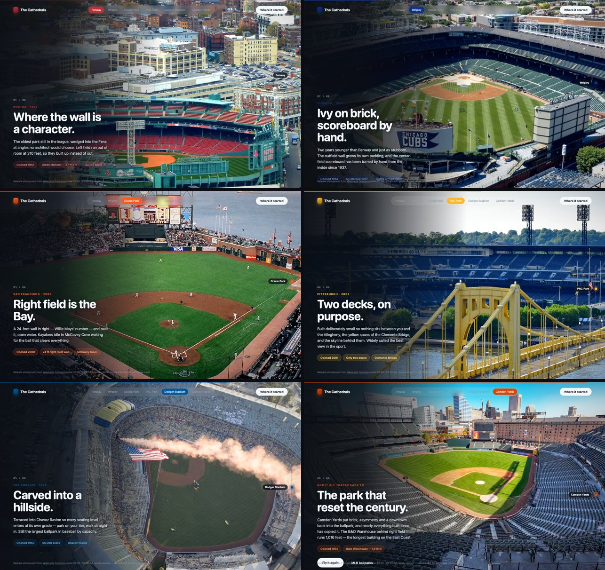

# The Cathedrals — a scroll-world evaluation

A working demo of [`oso95/scroll-world`](https://github.com/oso95/scroll-world): one
continuous camera flight through six Major League ballparks, driven entirely by scroll
position. Fenway to Wrigley to Oracle Park to PNC to Dodger Stadium to Camden Yards,
with no cuts anywhere in the chain.



## Run it

```bash
python3 -m http.server 8777
open http://127.0.0.1:8777
```

Then scroll slowly, and scroll back up. Two things are worth watching for:

1. **The camera moves; it isn't a parallax trick.** Scroll drives *time* through a real
   video clip, so the motion has perspective and parallax that CSS transforms can't fake.
2. **You never see a cut.** Between each pair of ballparks there's a connector clip whose
   first frame *is* the previous dive's last frame, and whose last frame *is* the next
   dive's first frame. Fifteen viewport-heights of scroll, eleven clips, no visible joins.

## What this actually demonstrates

The scroll-world repo is not an npm library — it's an **agent skill** (a `SKILL.md`) that
orchestrates a pipeline. Two separable things ship inside it:

| Piece | What it is | Cost |
| --- | --- | --- |
| `references/scrub-engine.js` | 448 lines of dependency-free vanilla JS: the scroll→video scrubber, lazy loading, seam crossfade, phone handling | free, portable |
| `SKILL.md` + `prompts.md` + `pipeline.md` | An AI art pipeline: GPT Image 2 stills, Seedance/Kling camera clips, frame-locked connectors | ~$27 per 6-scene chain, needs Monid or Higgsfield accounts |

**This demo uses the engine unmodified and replaces the paid half.** `scrub-engine.js` here
is byte-identical to upstream (sha256 `630bb1ab…`), so what you're judging is the real
thing, not a fork. Rather than pay a video model to generate camera moves,
`build/render_flight.py` synthesises them locally: every frame is a crop out of a
high-resolution photograph, animated with an eased camera path and encoded with ffmpeg.

That substitution is the most useful result of the evaluation. The engine is the part you'd
actually depend on, and it does not care where the pixels came from — so you can adopt the
technique without adopting the render bill, and swap in generated footage later for
anything a photograph can't cover.

## The seam rule, which is the whole trick

Everything else about this technique is ordinary video scrubbing. The reason it reads as
one continuous flight is a single constraint:

```
connector[i] first frame == dive[i]   last frame
connector[i] last frame  == dive[i+1] first frame
```

Upstream satisfies this by feeding the *actual rendered frames* of neighbouring clips back
into the video model as first/last-frame conditioning — which is why the skill only permits
models that can frame-lock a seam. Here the same camera function produces both sides of
every seam, so the match is exact by construction rather than by conditioning:

```
$ python3 build/render_flight.py
seam check (mean abs pixel diff, 0 = frame-identical):
  dive[fenway]->conn0: 0.0000    conn0->dive[wrigley]: 0.0000
  ...
all seams frame-identical
```

`build/verify.py` then re-checks the claim against the *encoded* files, because what the
browser decodes is what matters:

```
$ python3 build/verify.py
worst raw delta        4.34 / 255  (includes codec grain)
worst structural delta 1.15 / 255  (real discontinuity)
PASS - no geometric discontinuity at any seam; the flight has no cuts.
```

The raw delta is per-clip quantisation noise, which reads as grain. The structural delta —
the same comparison with codec noise blurred away — is what would show up as a visible
jump, and it's essentially zero.

## Things worth knowing before adopting it

Findings from the build, all of which apply whether or not you use the paid pipeline:

- **Tight GOPs carry a real but bounded premium.** The engine scrubs by seeking, and seek
  cost is distance from the last keyframe, so clips need `-g 8` (`-g 4` on phones). Measured
  on one dive/connector pair, that costs about **1.6x** over a default GOP — not the
  order-of-magnitude I expected, and cheap for what it buys:

  | keyframe interval | size | vs `-g 8` |
  | --- | --- | --- |
  | `-g 8` (what the engine wants) | 8.27 MB | 1.00x |
  | `-g 24` | 6.35 MB | 0.77x |
  | `-g 250` (typical default) | 5.24 MB | 0.63x |

  Quality is the bigger lever and stays fully negotiable: at `-g 8`, crf 20 costs 15.84 MB
  where crf 26 costs 8.27 MB. Reproduce both tables with `python3
  build/encode_tradeoffs.py`. All in, the demo is 47 MB desktop + 26 MB mobile for ~30
  seconds of flight.
- **Skip the pre-denoise.** Packed crowds look like exactly the high-frequency noise a
  denoiser should help with, and it seemed an obvious win, but `hqdn3d` measured at under
  2% of file size on this material while slightly *widening* the seam delta. It's not in the
  pipeline as a result.
- **Frame rate is nearly free to trade away.** Scroll drives time, so fps only sets how
  finely the flight can be scrubbed. Dropping 30 → 24 cost nothing perceptible and saved
  20%.
- **Everything loads as a Blob and stays in memory.** `loadClip()` fetches each clip via
  `fetch()` → `URL.createObjectURL` and never revokes it. Fine at eleven clips; worth
  patching before you scale to thirty ballparks.
- **The engine degrades honestly.** Under `prefers-reduced-motion` it never loads video at
  all and cross-dissolves the stills instead. A missing or 404ing clip falls back to its
  poster, and a null connector becomes a plain crossfade — a scene failing to render can't
  take the page down.
- **Its default CSS assumes a light theme.** Primary buttons and nav pills are
  `color:#fff; background:var(--sw-ink)`, which inverts badly on a dark page. `index.html`
  overrides them. Custom scrim gradients must stay at `90deg`, too — any other angle stops
  short of the box corner and leaves a visible hard edge.

## Rebuilding the assets

Nothing here needs an API key, an account, or `brew` — `imageio-ffmpeg` ships a static
ffmpeg binary.

```bash
pip3 install imageio-ffmpeg pillow numpy

python3 build/prepare_bases.py   # fetch the six photos, normalise to 3200x1800 bases
python3 build/render_flight.py   # render + encode the 22 clips (~2 min)
python3 build/verify.py          # inventory, GOP check, decoded seam check
```

`prepare_bases.py` pins each photo by explicit Commons filename, so a rebuild reproduces
the current bases exactly rather than re-rolling whatever search ranks first today. Two
optional tools are how those six were chosen in the first place, for when you want
different ballparks:

```bash
python3 build/find_photos.py       # search Commons, filtered by title and aspect ratio
python3 build/shortlist.py         # download candidates + contact sheets to eyeball
python3 build/preview_focal.py     # aim a dive: renders only its final frame
python3 build/encode_tradeoffs.py  # re-measure the encode trade-offs above
```

Search relevance alone is unreliable here — a "Dodger Stadium panorama" query returns
Marlins Park, and "PNC Park" returns PNC Field, a different minor-league park — which is
why the discovery scripts filter on title keywords and why the picks get eyeballed on a
contact sheet before being pinned.

To change the flight, edit `SCENES` in `build/render_flight.py` — each entry is a slug, a
normalised `focal` point the camera dives toward, and a `drift` that steers its exit.
`prepare_bases.py` writes `build/sheet-grid.png` with a normalised coordinate grid so focal
points can be read straight off it. Then mirror the ordering in the `sections` and
`connectors` arrays in `index.html`.

An optional visual regression pass drives the page in real Chrome:

```bash
cd build && npm install          # puppeteer-core only, uses your installed Chrome
cd .. && MODE=sections NODE_PATH=build/node_modules node build/shoot.js
```

It reports clip count, decoder `readyState`, active nav item and copy opacity at each
scene, and fails loudly on console errors or failed requests.

## What's missing versus the full skill

- **Native portrait mobile.** Upstream renders a second chain composed for 9:16. The
  `-m.mp4` files here are 720p `-g 4` landscape encodes — lighter and smoother to scrub on
  a phone, but still a landscape crop.
- **Interiors the camera can enter.** A photograph can only be pushed into, not flown
  *through*. Genuine exterior-to-interior moves need either generated footage or
  [Google Earth Studio](https://www.google.com/earth/studio/), which does free cinematic
  camera paths over real stadium geometry and is the natural next step for real venues.
- **The interview and budget flow.** Not exercised, since nothing was generated.

## Photo credits

Sources from Wikimedia Commons, cropped and colour-graded here. Licence terms require
attribution:

| Ballpark | Photographer | Licence |
| --- | --- | --- |
| [Fenway Park](https://commons.wikimedia.org/wiki/File:Boston_-_View_from_Prudential-Tower_-_Fenway_Park_-_Baseball-Team_Boston_Red_Sox_-_panoramio.jpg) | giggel | CC BY 3.0 |
| [Wrigley Field](https://commons.wikimedia.org/wiki/File:Wrigley_Field_in_line_with_home_plate.jpg) | Sea Cow | CC BY-SA 4.0 |
| [Oracle Park](https://commons.wikimedia.org/wiki/File:ATT_Sunset_Panorama.jpg) | Bspangenberg | CC BY 3.0 |
| [PNC Park](https://commons.wikimedia.org/wiki/File:PNC_Park_with_Roberto_Clemente_Bridge_May_2018.jpg) | Y2kcrazyjoker4 | CC BY-SA 4.0 |
| [Dodger Stadium](https://commons.wikimedia.org/wiki/File:Flickr_-_Official_U.S._Navy_Imagery_-_Sailor_on_Navy_Parachute_Team_displays_an_American_flag_above_Dodger_Stadium_during_a_baseball_game.jpg) | James Woods, U.S. Navy | Public domain |
| [Camden Yards](https://commons.wikimedia.org/wiki/File:Oriole_Park_at_Camden_Yards_with_Baltimore_skyline_in_the_background_in_2023.jpg) | Quintin Soloviev | CC BY 4.0 |

`scrub-engine.js` is MIT, from `oso95/scroll-world`. Team colours and marks belong to their
clubs; this is an unaffiliated technical demo.
